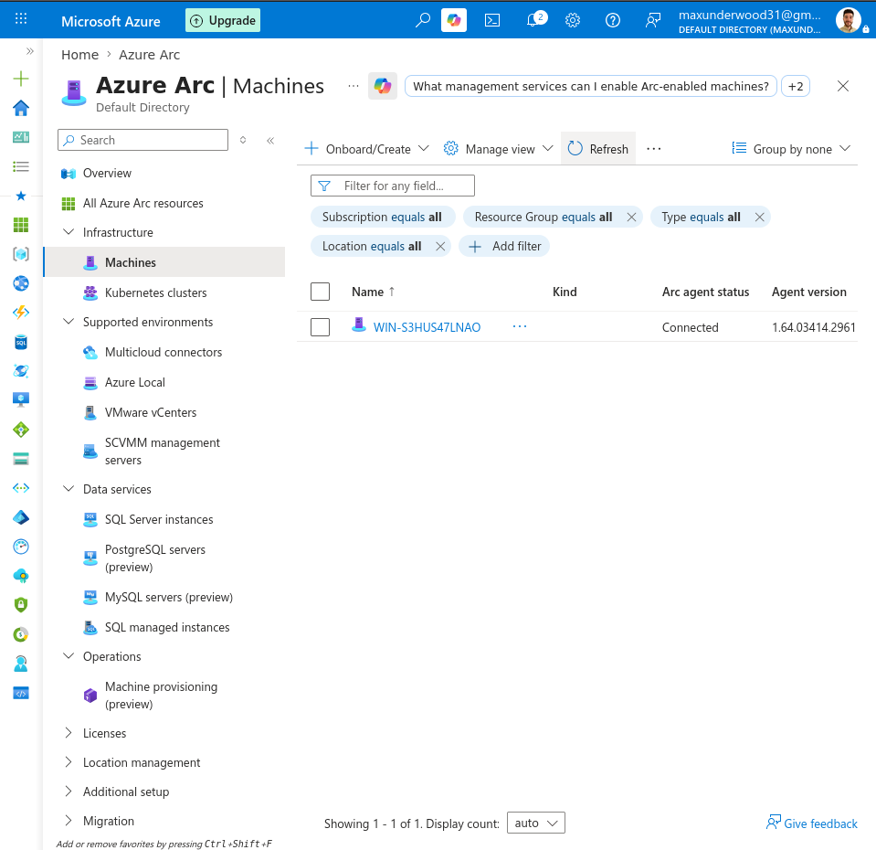
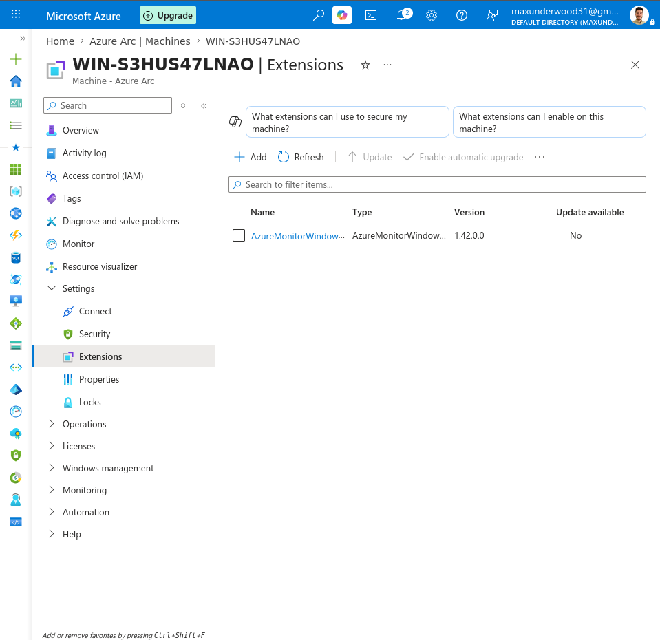
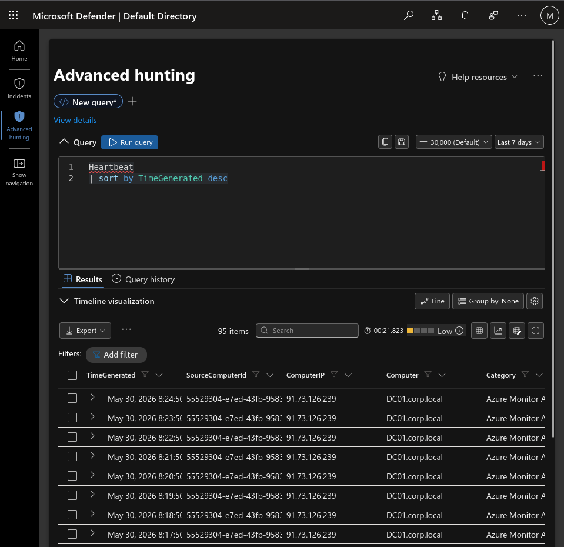
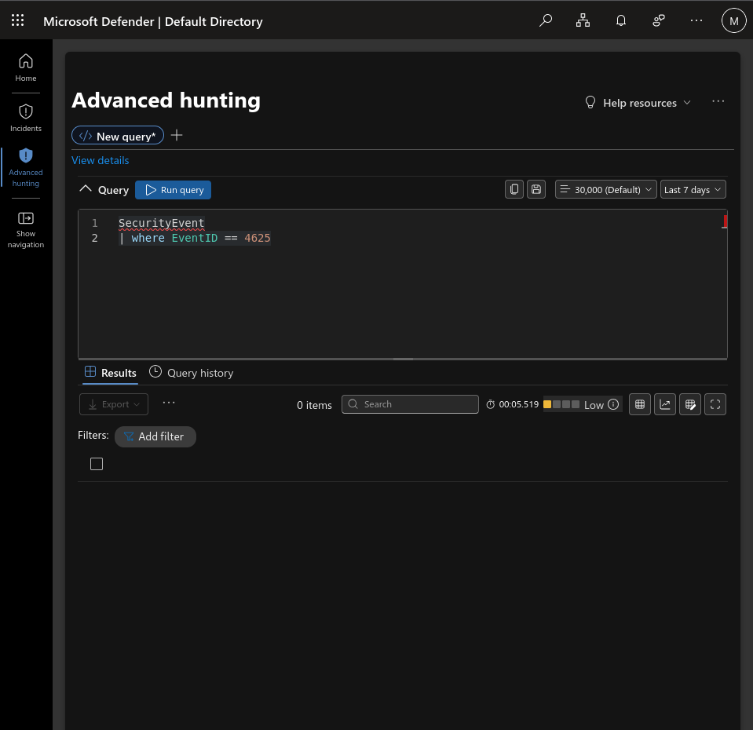
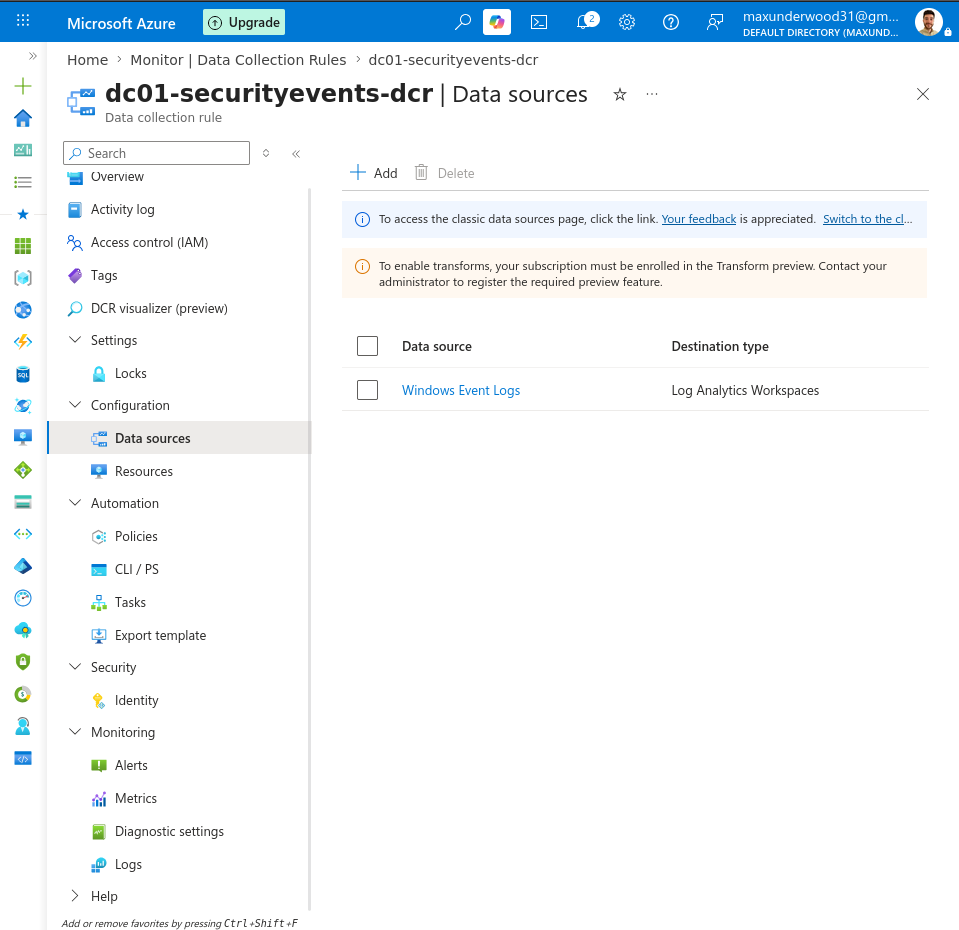

# Active Directory Telemetry Investigation – Microsoft Sentinel Case Study

---

# Active Directory SOC Incident Report – Azure Sentinel Lab

## 1. Executive Summary

This project documents an Active Directory security monitoring lab using Microsoft Sentinel.  
The environment simulates a domain controller (DC01) generating authentication and system events forwarded through Azure Arc and Azure Monitor Agent (AMA) into a Log Analytics workspace.

During the investigation, a critical issue was identified: **loss of authentication telemetry (Event IDs 4624/4625)** due to Azure Arc connectivity instability and/or ingestion pipeline misconfiguration.

---

## 2. Environment Overview

- Windows Server 2022 (Domain Controller – DC01)
- Windows 11 / Kali VM (attack simulation)
- Azure Arc-enabled server
- Azure Monitor Agent (AMA)
- Data Collection Rules (DCR)
- Microsoft Sentinel (Log Analytics Workspace)

---

## 3. Objective

- Ingest Active Directory Security Events into Sentinel
- Detect authentication activity (4624 success / 4625 failure)
- Simulate brute-force RDP attacks
- Validate SIEM visibility of authentication events

---

## 4. Incident Description

### Observed Issue
- Only partial telemetry ingestion was available:
  - Heartbeat logs present
  - Event ID 4688 (process creation) present
- Missing critical authentication logs:
  - Event ID 4624 (successful logons)
  - Event ID 4625 (failed logons)

### System State
- Azure Arc initially connected, later intermittently disconnected
- AMA agent installed and running
- DCR assigned but authentication logs not flowing

---

## 5. Investigation Summary

- Verified Azure Arc onboarding status
- Confirmed AMA agent operational state
- Validated DCR assignment to DC01
- Queried Log Analytics workspace:
  - Heartbeat: Present
  - 4688 Process Logs: Present
  - 4624/4625: Missing

---

## 6. Root Cause Analysis (Suspected)

- Azure Arc connectivity instability (public Wi-Fi environment)
- Potential interruption of outbound HTTPS (443) traffic
- Possible misconfiguration or filtering in Data Collection Rule
- Resulting in incomplete SecurityEvent ingestion pipeline

---

## 7. Evidence

### Evidence Collected
- Azure Arc connection status (intermittent/disconnected)
- AMA agent running on DC01
- Sentinel logs showing partial ingestion
- Missing authentication event queries (4624/4625)

### Evidence Mapping
See full breakdown:
- [Evidence Mapping](evidence/evidence-mapping.md)

---

## 8. MITRE ATT&CK Mapping

Observed and expected behaviors mapped to MITRE framework:

- Brute Force (T1110)
- Valid Accounts (T1078)
- Remote Desktop Protocol (T1021.001)

Full mapping:
- [MITRE ATT&CK Mapping](incident-report/mitre-attack-mapping.md)

---

## 9. Impact

- No authentication visibility in SIEM
- Detection rules for brute-force attacks non-functional
- SOC monitoring blind spot for login activity
- Partial telemetry reduced detection confidence

---

## 10. Conclusion

This lab demonstrates a real-world SOC issue where:
> “Endpoint agents appear functional, but critical security telemetry is missing from the SIEM.”

The investigation highlights the importance of:
- Stable Azure Arc connectivity
- Correct DCR configuration
- Incremental validation of log ingestion pipelines

---

## 11. Architecture

---

## 12. Status

**Status:** Incident documented (incomplete ingestion / troubleshooting case study)

---

## Keywords
Azure Sentinel, SOC, SIEM, Active Directory, Windows Security Events, Incident Response, Azure Arc, AMA, DCR, MITRE ATT&CK, Cybersecurity Lab, Log Analytics

## Quick Summary

- Built a full AD monitoring pipeline using Azure Sentinel
- Investigated missing SecurityEvent ingestion (4624/4625)
- Identified telemetry pipeline breakdown via Azure Arc + AMA + DCR
- Documented full SOC-style incident report with MITRE mapping
- Simulated real-world SIEM visibility failure scenario

---

## Documentation

- Architecture: `/architecture`
- Evidence: `/evidence`
- Logs & Queries: `/kql`
- Investigation Notes: `/docs`

---

## Evidence Pack

This section contains supporting artifacts collected during the investigation.

### 1. Azure Arc Status
Shows onboarding state of the domain controller within Azure Arc.

---

### 2. Azure Monitor Agent (AMA)
Confirms telemetry agent is installed and running on DC01.

---

### 3. Heartbeat Validation
Confirms partial connectivity between endpoint and Sentinel.

---

### 4. Process Execution Logs (4688)
Confirms partial SecurityEvent ingestion.

---

### 5. Missing Authentication Logs (4625)
No failed authentication events observed in Sentinel.

This indicates a visibility gap in the SIEM pipeline.

---

### 6. Data Collection Rule (DCR)
Configuration responsible for defining log ingestion scope.

---

## What This Evidence Demonstrates

This investigation confirms a partial failure in the telemetry pipeline:

- Endpoint connectivity established (Arc + AMA functional)
- System-level logs partially ingested (4688, Heartbeat)
- Authentication telemetry missing (4624/4625)

### Key Insight
A system can appear "healthy" at the agent level while still failing at the SIEM ingestion layer.

This creates a critical visibility gap in security monitoring for authentication-based attacks.

